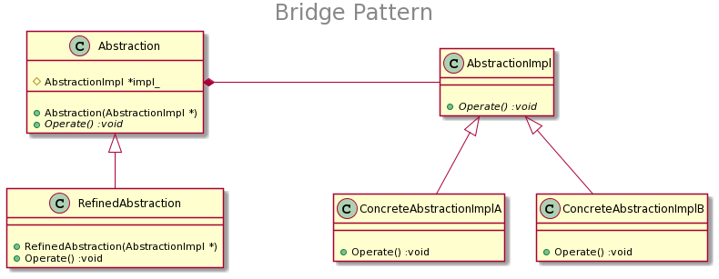

## Pattern: Bridge（桥接模式）

### 模式结构

　如上图所示，桥接模式包含如下角色：
+ Abstraction：抽象类
+ RefinedAbstraction：扩充抽象类
+ AbstractionImpl：实现类接口
+ ConcreteAbstractionImpl：具体实现类
    + ConcreteAbstractionImplA
    + ConcreteAbstractionImplB