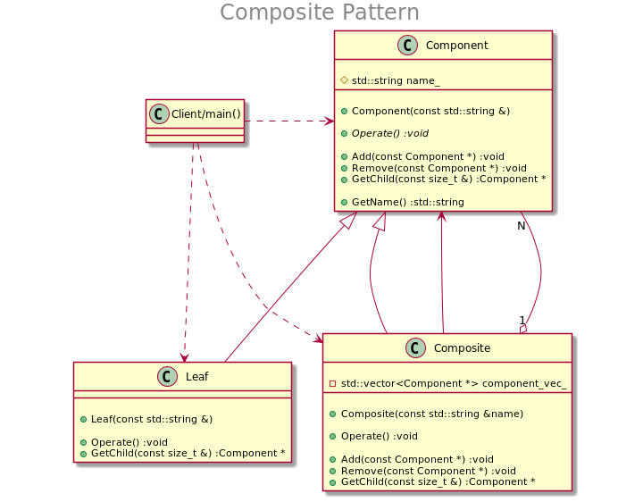

## Pattern: Composite（组合模式）

### 模式结构

　如上图所示，组合模式包含如下角色：
+ Component: 基础接口
    1. 为组合中的对象声明接口；
    2. 在适当的情况下，实现所有类共有接口的缺省行为；
    3. 声明一个接口用于访问和管理Component的子组件。
+ Leaf: 叶节点组件
    1. 在组合中表示叶节点对象，叶节点没有子节点；
    2. 在组合中定义叶节点的行为。
+ Composite: 复杂节点组件
    1. 定义有子部件的那些部件的行为；
    2. 存储子部件。
+ Client(main() in sample)
    1. 通过Component接口操作组合部件的对象,与所有组件进行交互；
    2. 客户端代码便可同时支持简单叶节点组件和复杂组件。
